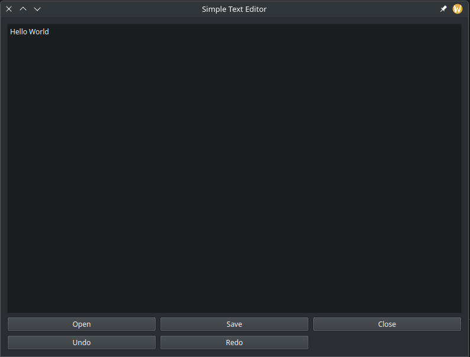

# A Simple Text Editor in C++
Just a small text editor made for practice C++ programming.



## Installation

1. Clone the repository:
   ```bash
   git clone https://github.com/kaveen-lakmuthu/text_editor_in_c++.git
   ```

2. Compile the program:
   ```bash
   make
   ```

3. Run the shell:
   ```bash
   ./TextEditor
   ```

## Usage
This text editor is capable of creating, editing and saving a simple text file. it also includes Redo and Undo functions.

## License

This project is licensed under the MIT License - see the [LICENSE](LICENSE) file for details.